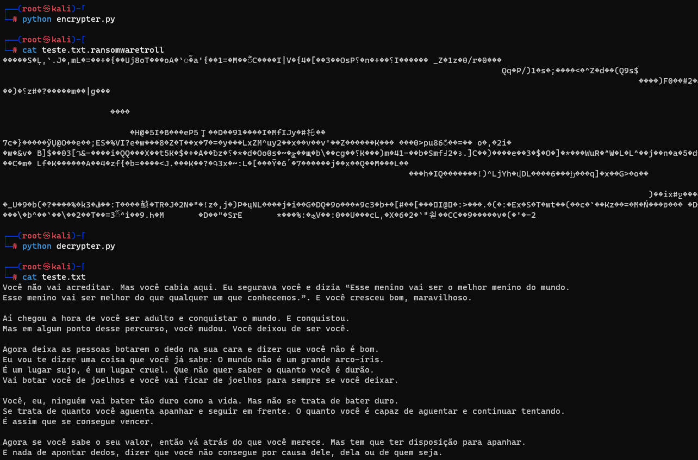

## Esse foi um desafio realizado na DIO, nele o objetivo é criar um ransomware utilizando a linguagem Python.

## O objetivo é fazer um script para criptografar e descriptografar um arquivo.

### Ferramentas

- Kali Linux
- Python

### Comandos utilizados

- Acesso root: ``` sudo su ```
- Realizar a criptografia: ``` python encrypter.py ```
- Verificar o aquivo criptografado: ``` nano teste.txt.ransomwaretroll ``` ou ``` cat teste.txt.ransomwaretroll ```
- Realizar a descriptografia: ``` python decrypter.py ```
- Verificar o aquivo descriptografado: ``` nano teste.txt ``` ou ``` cat teste.txt ```

### Resutados


